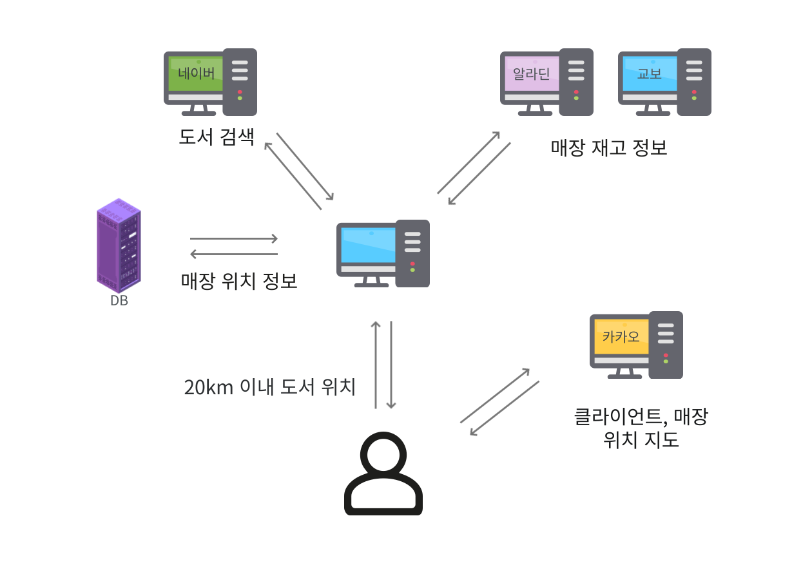
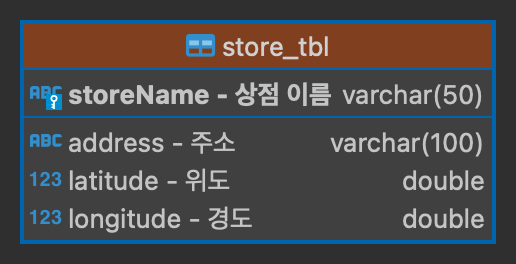

# booksAroundMe (위치기반 도서 검색)

# 목차
* [개발 환경](#개발-환경)
* [사용 기술](#사용-기술)
* [시스템 아키텍처](#시스템-아키텍처)
* [프로젝트 동기 및 개요](#프로젝트-동기-및-개요)
* [프로젝트를 통해 느낀점](#프로젝트를-통해-느낀점)

## 개발 환경
* intelliJ
* Dbeaver
* GitHub

## 사용 기술
* Java 11 openjdk
* SpringBoot 2.6.4
* Mybatis
* Thymeleaf
* BootStrap5

## 빌드
* Gradle

## 데이터 베이스
* MariaDB

## 주요 라이브러리
* Lombok
* Jsoup
* Kakao-map
* Naver-api
* Aladin-api

## 시스템 아키텍처

## 데이터베이스 테이블

## 프로젝트 동기 및 개요
요즘은 전자책이 보편화 되어있지만 개인적으로 눈이 편하고 집중이 잘 되며 손으로 느낄 수 있는 종이책을 선호합니다.

무언가에 매료되면 바로 해야만 직성이 풀리는 성격이라서 온라인 주문보다 오프라인 매장을 이용하곤 했는데

종이책에 대한 수요가 줄어서인지 베스트셀러가 아니면 1,2부만 있거나 재고가 없는 경우도 종종 있었습니다.

그래서 위치기반 도서 재고 어플리케이션을 만들어보면 어떨까 하는 생각에서 프로젝트를 구상하게 되었고

마침 공부하고 있던 책과 개발환경을 맞추어서 시작하였습니다.

어플리케이션의 기능은 굉장히 단순합니다.

클라이언트가 검색을 하면 네이버 API를 이용하여 검색결과를 보여주고 책을 선택하면 브라우저에서 클라이언트의 위치를 서버에 보내주고 서버는 알라딘 API를 이용해 재고가 존재하는 매장명을 가지고 옵니다.

교보문고는 API가 존재하지 않기 때문에 크롤링으로 재고 정보를 가져옵니다.

그렇게 가지고 온 매장명을 이용해 데이터베이스에서 매장들의 좌표를 가지고 와서 거리를 계산 후 20km 이내에 재고가 존재하는 매장 10군데를 보여주고 그 과정에서 카카오맵을 이용하고 있습니다.

## 아쉬운 점

현재 클라이언트가 책을 선택하면 전국에 매장과 재고 정보를 다 가지고 와서 정렬 후에 10개의 데이터를 추리고 있습니다. 클라이언트의 위치를 기반으로 크롤링의 범위를 줄인다면 조금 더 쾌적환 환경이 될 것입니다.

## 프로젝트를 통해 느낀점

책의 예제를 따라 치는 것이 아닌 스스로 계획하고 만들어가는 과정이 너무나 즐거웠습니다.

API를 이용해 데이터를 다루고 다른 웹사이트에서 내가 원하는 정보를 가져오는 일은 생각보다 간단했으며

구글링을 통해 만나게 된 많은 개발자분들 덕에 완성할 수 있었다고 생각합니다.

한편으로 저의 부족한 부분들을 바로 직면할 수 있었는데

내가 만들고 있는 이 기능이 계층형 아키텍처에서 어디에 들어가야 하는지, 기능들을 얼마나 더 세분화해야 하는지, 지금 이 코드가 누가봐도 알아볼 수 있는 코드인지 등

설계와 아키텍처, 클린코드 학습에 필요성을 절실히 느낄 수 있었습니다.
